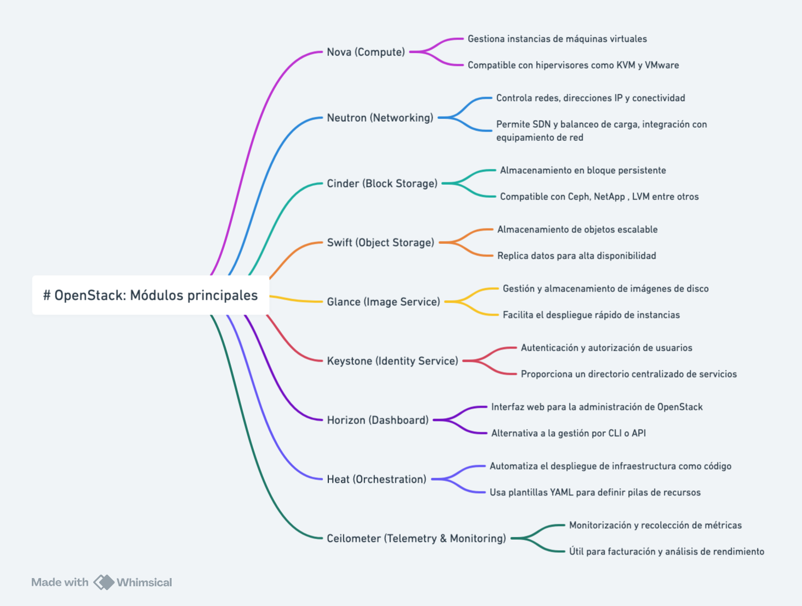

# OpenStack
OpenStack es una plataforma de software de código abierto para la computación en la nube, que permite la creación y gestión de infraestructuras de nube pública y privada. Fue diseñado para ser escalable y flexible, proporcionando una solución robusta para la gestión de recursos de computación, almacenamiento y redes. OpenStack es utilizado por una amplia variedad de organizaciones, desde pequeñas empresas hasta grandes corporaciones y proveedores de servicios en la nube. 🌐

{width=60%}
## Módulos de OpenStack 🚀

OpenStack está compuesto por una serie de módulos que se integran para ofrecer una solución completa de nube. Algunos de los módulos más importantes son:

- **Nova**: Proporciona servicios de computación, permitiendo la gestión de máquinas virtuales. Es el componente central de la gestión de instancias de computación.
- **Neutron**: Ofrece servicios de red, gestionando redes y direcciones IP. Permite la creación de redes complejas y la asignación de IPs a las instancias.
- **Cinder**: Proporciona servicios de almacenamiento en bloque, permitiendo la gestión de volúmenes de almacenamiento. Es ideal para bases de datos y aplicaciones que requieren almacenamiento persistente.
- **Swift**: Ofrece almacenamiento de objetos, permitiendo el almacenamiento y recuperación de datos no estructurados. Es altamente escalable y adecuado para almacenar grandes cantidades de datos.
- **Glance**: Proporciona servicios de gestión de imágenes, permitiendo la gestión de imágenes de disco. Facilita la creación y el mantenimiento de imágenes de sistema operativo.
- **Keystone**: Ofrece servicios de identidad, gestionando la autenticación y autorización de usuarios. Es el componente de seguridad central de OpenStack.
- **Horizon**: Proporciona una interfaz gráfica de usuario para la gestión de OpenStack. Permite a los usuarios interactuar con OpenStack a través de un navegador web.
- **Heat**: Ofrece servicios de orquestación, permitiendo la gestión de la infraestructura como código. Facilita la automatización del despliegue de recursos.
- **Ceilometer**: Proporciona servicios de telemetría, permitiendo la monitorización y medición de recursos. Es útil para la facturación y la monitorización del rendimiento.

## Entornos donde está desplegado OpenStack 🌍

OpenStack se despliega en una variedad de entornos, incluyendo:

- **Nubes Públicas**: Proveedores de servicios en la nube como Rackspace y OVH utilizan OpenStack para ofrecer servicios de nube pública a sus clientes.
- **Nubes Privadas**: Muchas empresas despliegan OpenStack en sus propios centros de datos para crear nubes privadas, proporcionando a sus empleados y departamentos una infraestructura flexible y escalable.
- **Nubes Híbridas**: OpenStack puede integrarse con otras soluciones de nube pública como AWS, Azure y Google Cloud, permitiendo la creación de nubes híbridas que combinan lo mejor de ambos mundos.
- **Centros de Datos de Investigación**: Instituciones académicas y de investigación utilizan OpenStack para gestionar sus recursos de computación y almacenamiento, facilitando la colaboración y el acceso a grandes volúmenes de datos.
- **Telecomunicaciones**: Empresas de telecomunicaciones despliegan OpenStack para gestionar sus infraestructuras de red y ofrecer servicios avanzados a sus clientes.

## Distribuciones y Métodos de Despliegue 🛠️

Existen varias distribuciones y métodos de despliegue de OpenStack, cada una con sus propias características y ventajas. Algunas de las más populares son:

- **Red Hat OpenStack Platform**: Una distribución comercial de OpenStack ofrecida por Red Hat, que incluye soporte y servicios adicionales. Es conocida por su estabilidad y soporte empresarial.
- **Mirantis OpenStack**: Ofrecida por Mirantis, esta distribución se centra en la facilidad de uso y la flexibilidad, proporcionando herramientas avanzadas para la gestión y el despliegue de OpenStack.
- **Canonical OpenStack**: Distribuida por Canonical, la empresa detrás de Ubuntu. Esta versión de OpenStack está optimizada para funcionar con Ubuntu y ofrece integración con otras herramientas de Canonical.
- **SUSE OpenStack Cloud**: Una distribución de OpenStack ofrecida por SUSE, que se enfoca en la facilidad de uso y la integración con otras soluciones de SUSE.
- **OpenStack-Ansible**: Un método de despliegue que utiliza Ansible para automatizar la instalación y configuración de OpenStack. Es ideal para aquellos que prefieren una solución basada en Ansible.
- **Kolla-Ansible**: Utiliza contenedores Docker y Ansible para desplegar OpenStack. Es conocido por su flexibilidad y capacidad para gestionar despliegues complejos.
- **DevStack**: Una herramienta de despliegue rápida y sencilla para desarrolladores que desean probar y desarrollar sobre OpenStack. No está destinada para entornos de producción, pero es excelente para pruebas y desarrollo.

Cada una de estas distribuciones y métodos de despliegue ofrece diferentes ventajas y puede ser adecuada para diferentes casos de uso, dependiendo de las necesidades específicas de la organización y del entorno en el que se vaya a desplegar OpenStack.

## Enlaces de Interés 🔗

- [Sitio Oficial de OpenStack](https://www.openstack.org/)
- [Documentación de OpenStack](https://docs.openstack.org/)
- [Código Fuente en GitHub](https://github.com/openstack)
- [Comunidad de OpenStack](https://www.openstack.org/community/)

OpenStack es una solución poderosa y flexible para la gestión de infraestructuras de nube, utilizada por muchas organizaciones en todo el mundo para construir y gestionar sus entornos de nube. Su naturaleza de código abierto y su amplia comunidad de desarrolladores y usuarios aseguran que OpenStack continúe evolucionando y mejorando con el tiempo. 🚀

