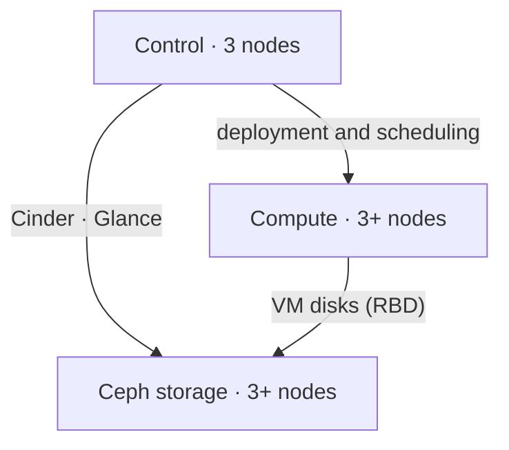

# Reference architecture

!!! info "A starting point, not a closed product"

    Every deployment is sized from the client's real workloads. What follows is
    an **example production scenario**: the minimum configuration on which a
    private cloud can sustain production without single points of failure. From
    here it grows or gets adjusted.

## Baseline scenario

Nine nodes, in three roles:

| Role | Nodes | Purpose |
| --- | --- | --- |
| Control | 3 | OpenStack API, database, messaging, scheduling |
| Compute | 3+ | Run the virtual machines. The role that grows first |
| Storage | 3+ | Ceph cluster: monitors and OSDs |

Three is the minimum for both control and storage, for the same reason: both
depend on **quorum**. With two nodes, losing one leaves the cluster without a
majority and the platform stops. With three, one failure is tolerated.

### High availability on control

The three control nodes run active-active:

- **API**: HAProxy load-balances and `keepalived` holds a virtual IP. Losing one
  node does not interrupt the API service.
- **Database**: MariaDB in a Galera cluster, synchronous replication.
- **Messaging**: RabbitMQ clustered with replicated queues.

### Compute

KVM hypervisor. This is the role that grows first: adding capacity means adding
nodes, without touching the rest of the platform.

Where the design calls for it, nodes with different profiles — extra memory,
GPUs, fast local storage — are set aside and exposed through flavors and host
aggregates.

### Storage

Ceph with **triple replication** and a host-level failure domain: the three
copies of each object live on different nodes, so losing a whole node does not
mean losing data.

It serves, simultaneously:

- **RBD** → instance disks (Nova) and volumes (Cinder).
- **RBD** → images (Glance), with copy-on-write cloning: creating an instance
  from an image copies no data.
- **RGW** → S3-compatible object storage, where needed.

## Network separation

The planes are kept apart, on separate VLANs and — where the design justifies it
— on separate physical interfaces:

| Plane | Purpose | Note |
| --- | --- | --- |
| Management | Deployment and internal service communication | No internet egress |
| API / external | User access to Horizon and the API; floating IPs | The only exposed plane |
| Tenant | Traffic between instances, encapsulated (VXLAN or GENEVE) | Isolated per project |
| Storage | Client traffic against Ceph | Latency-sensitive |
| Ceph replication | Replication and recovery between OSDs | Spikes when a disk is lost |
| IPMI / BMC | Out-of-band hardware management | Separate administrative network |

Separating **storage** from **Ceph replication** is not a luxury: when the
cluster rebuilds after losing a disk, replication saturates the link. If it
shares a plane with client traffic, instances feel the degradation at exactly
the worst moment.

## Deployed software

| Layer | Component | Version |
| --- | --- | --- |
| Cloud | OpenStack | 2026.1 *Gazpacho* (SLURP) |
| Storage | Ceph | Squid, 19.2.x or later |
| Deployment | Kolla-Ansible | branch matching the target release |
| Ceph installation | cephadm | matching the deployed series |

The core OpenStack services: Keystone (identity), Nova (compute), Neutron
(networking), Glance (images), Cinder (volumes), Placement, Horizon (web
dashboard). The rest — Heat, Octavia, Barbican, Manila — is added when the case
calls for it, not by default.

The reasoning behind these versions is in [Technical decisions](decisiones.md).

## What varies per client

What changes between projects, and what it depends on:

| Variable | Depends on |
| --- | --- |
| Number of compute nodes | Real CPU and memory usage, plus the agreed headroom |
| Ceph capacity | Data in use, growth rate and replication factor |
| Hyperconvergence | With few nodes, Ceph can share hardware with compute. Past a certain size it should be separated |
| Tenant network model | Provider VLANs or encapsulated networks, depending on what the existing physical network allows |
| Distribution across rooms or data centres | More than one location changes Ceph's failure domains |
| Integrations | The identity directory, monitoring, backup and ticketing the client already runs |

!!! warning "Not yet validated"

    This design is reasoned from OpenStack and Ceph recommended practice, but
    OctoFlex has not yet tested it in a production deployment of its own. Once
    that exists, this page will be updated with measured figures and this
    warning removed.
