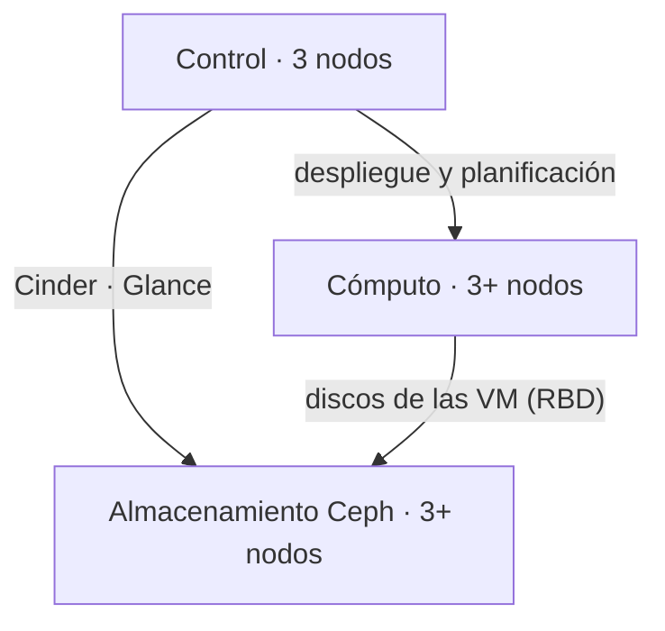

# Arquitectura de referencia

!!! info "Esto es un punto de partida, no un producto cerrado"

    Cada despliegue se dimensiona a partir de las cargas reales del cliente.
    Lo que sigue es un **escenario productivo de ejemplo**: la configuración
    mínima con la que una nube privada puede sostener producción sin puntos
    únicos de fallo. A partir de aquí se crece o se ajusta.

## Escenario base

Nueve nodos, en tres funciones:

| Función | Nodos | Cometido |
| --- | --- | --- |
| Control | 3 | API de OpenStack, base de datos, mensajería, planificación |
| Cómputo | 3+ | Ejecutan las máquinas virtuales. Es la función que crece primero |
| Almacenamiento | 3+ | Clúster Ceph: monitores y OSD |

Tres es el mínimo en control y en almacenamiento por la misma razón: ambos
dependen de **quórum**. Con dos nodos, perder uno deja al clúster sin mayoría y
la plataforma se detiene. Con tres, se tolera la caída de uno.

### Alta disponibilidad en control

Los tres nodos de control funcionan en activo-activo:

- **API**: HAProxy reparte y `keepalived` mantiene una IP virtual. La caída de
  un nodo no interrumpe el servicio de API.
- **Base de datos**: MariaDB en clúster Galera, replicación síncrona.
- **Mensajería**: RabbitMQ en clúster con colas replicadas.

### Cómputo

Hipervisor KVM. Es la función que crece primero: añadir capacidad es añadir
nodos, sin tocar el resto de la plataforma.

Si el diseño lo requiere, se reservan nodos con perfiles distintos —memoria
ampliada, GPU, almacenamiento local rápido— y se exponen mediante tipos de
instancia y agregados de host.

### Almacenamiento

Ceph con **replicación triple** y dominio de fallo a nivel de host: las tres
copias de cada objeto viven en nodos distintos, de modo que perder un nodo
entero no supone pérdida de datos.

Sirve simultáneamente:

- **RBD** → discos de las instancias (Nova) y volúmenes (Cinder).
- **RBD** → imágenes (Glance), con clonado por copia en escritura: crear una
  instancia a partir de una imagen no copia datos.
- **RGW** → almacenamiento de objetos compatible con S3, si se necesita.

## Separación de redes

Los planos van separados, en VLAN distintas y —donde el diseño lo justifique—
sobre interfaces físicas distintas:

| Plano | Cometido | Nota |
| --- | --- | --- |
| Gestión | Despliegue y comunicación interna entre servicios | Sin salida a internet |
| API / externa | Acceso de usuarios a Horizon y a la API; IP flotantes | Único plano expuesto |
| Inquilinos | Tráfico entre instancias, encapsulado (VXLAN o GENEVE) | Aislado por proyecto |
| Almacenamiento | Tráfico de cliente contra Ceph | Sensible a latencia |
| Replicación Ceph | Replicación y recuperación entre OSD | Se dispara al perder un disco |
| IPMI / BMC | Gestión fuera de banda del hardware | Red administrativa aparte |

Separar **almacenamiento** de **replicación Ceph** no es un lujo: cuando el
clúster reconstruye tras la pérdida de un disco, la replicación satura el
enlace. Si comparte plano con el tráfico de cliente, las instancias notan la
degradación justo en el peor momento.

## Software desplegado

| Capa | Componente | Versión |
| --- | --- | --- |
| Nube | OpenStack | 2026.1 *Gazpacho* (SLURP) |
| Almacenamiento | Ceph | Squid, 19.2.x o superior |
| Despliegue | Kolla-Ansible | rama de la release objetivo |
| Instalación de Ceph | cephadm | la de la serie desplegada |

Los servicios base de OpenStack: Keystone (identidad), Nova (cómputo), Neutron
(red), Glance (imágenes), Cinder (volúmenes), Placement, Horizon (panel web).
El resto —Heat, Octavia, Barbican, Manila— se incorpora si el caso lo pide, no
por defecto.

El porqué de estas versiones está en [Decisiones técnicas](decisiones.md).

## Qué varía en cada cliente

Lo que cambia de un proyecto a otro, y de qué depende:

| Variable | Depende de |
| --- | --- |
| Número de nodos de cómputo | Consumo real de CPU y memoria, más el margen de crecimiento acordado |
| Capacidad de Ceph | Datos en uso, ritmo de crecimiento y factor de replicación |
| Hiperconvergencia | Con pocos nodos, Ceph puede convivir con el cómputo. A partir de cierto tamaño conviene separarlo |
| Modelo de red de inquilinos | VLAN de proveedor o redes encapsuladas, según lo que permita la red física existente |
| Distribución en salas o CPD | Si hay más de una ubicación, condiciona los dominios de fallo de Ceph |
| Integraciones | Directorio de identidad, monitorización, respaldo y ticketing que ya use el cliente |

!!! warning "Pendiente de validar"

    Este diseño está razonado a partir de las prácticas recomendadas de
    OpenStack y Ceph, pero OctoFlex todavía no lo ha contrastado en un
    despliegue propio en producción. Cuando exista, esta página se actualizará
    con las cifras medidas y esta advertencia desaparecerá.
